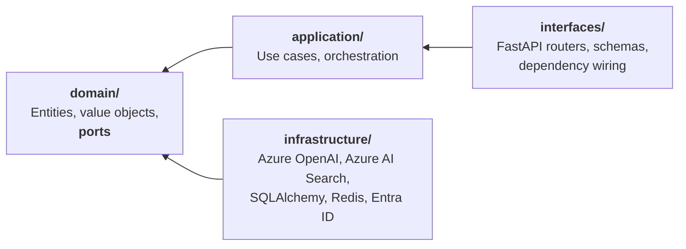

<div align="center">

# Paimon

**An AI Operations Platform for engineering organizations.**

Turns scattered operational knowledge — runbooks, postmortems, ADRs, API docs — into
grounded answers, cited evidence and automated workflows.

</div>

---

> **Project status: Phase 1 of 8 — Foundation.**
> Architecture and decision records are complete. Application code is being built in
> reviewable increments. This README is updated at the end of every phase; nothing is
> described here as working before it works.

---

## The problem

Engineering organizations do not lack documentation. They lack *retrievable* documentation.

The runbook that would have resolved an incident exists, in a repository nobody thought to
search. The postmortem describing the same failure eighteen months ago is in a wiki that has
since been migrated twice. The answer is somewhere in an eight-hundred-page API reference.
Meanwhile the on-call engineer asks a colleague, because a person is a better retrieval
system than the tools available.

Generic chat assistants do not fix this. They answer confidently from parametric memory,
cite nothing, and cannot tell you when they do not know — which in operational contexts is
the only answer that matters.

## What Paimon does

Paimon is an operational layer over organizational knowledge. It is not a chatbot wrapper.

- **Grounded retrieval.** Hybrid semantic and keyword search over an indexed corpus, with
  every claim traced to its source. Answers carry citations or they are not returned.
- **Multi-agent workflows.** LangGraph-orchestrated agents that perform real operational
  tasks — incident triage against runbook and postmortem history, postmortem drafting from
  incident timelines, documentation gap analysis.
- **MCP integration.** Platform capabilities exposed over the Model Context Protocol, so
  the same tools are reachable from any MCP-capable client.
- **Measured, not asserted.** An evaluation pipeline scores faithfulness, groundedness,
  relevance and latency against a versioned benchmark set. Retrieval changes are accepted or
  rejected on numbers.
- **Observable.** Every LLM call traced, with token cost attributed per request.

## Architecture

Business logic is independent of every framework around it. FastAPI, LangGraph, Azure
OpenAI and Azure AI Search are all replaceable without touching the domain — a constraint
that is verified in CI, not merely claimed.



Every arrow points inward, and `import-linter` fails the build if one ever points outward.

📐 **[Full architecture overview](docs/architecture/overview.md)** — C4 context and container
diagrams, request flows, non-functional posture, and an honest list of known gaps.

### Design decisions

Every expensive decision is recorded with its alternatives and the consequences accepted,
including the negative ones.

| ADR | Decision |
|---|---|
| [0001](docs/adr/0001-use-madr-for-architecture-decisions.md) | Use MADR for architecture decisions |
| [0002](docs/adr/0002-monorepo-layout-and-module-boundaries.md) | Monorepo layout and enforced module boundaries |
| [0003](docs/adr/0003-ports-and-adapters-for-llm-and-vector-store.md) | Ports and adapters for LLM and vector store |
| [0004](docs/adr/0004-authentication-with-entra-id.md) | Authentication with Microsoft Entra ID |
| [0005](docs/adr/0005-python-toolchain.md) | Python toolchain: uv, ruff, mypy |
| [0006](docs/adr/0006-continuous-integration-from-phase-1.md) | Continuous integration from Phase 1 |
| [0007](docs/adr/0007-persistence-postgresql-sqlalchemy-alembic-redis.md) | Persistence: PostgreSQL, SQLAlchemy, Alembic, Redis |
| [0008](docs/adr/0008-target-domain-engineering-operations.md) | Target domain: engineering operations |

## Technology

| Layer | Choice | Why |
|---|---|---|
| Backend | FastAPI · Python 3.13 | Async throughout, native OpenAPI, first-class typing |
| Frontend | Next.js 15 · TypeScript · Tailwind · shadcn/ui | Streaming UI, strict types |
| Agents | LangGraph | Explicit state machines over implicit agent loops |
| LLM | Azure OpenAI · local OpenAI-compatible | Behind a port — see [ADR-0003](docs/adr/0003-ports-and-adapters-for-llm-and-vector-store.md) |
| Retrieval | Azure AI Search · pgvector | Two adapters, one contract, benchmarked against each other |
| Data | PostgreSQL 17 · Redis 7 | System of record, and cache plus coordination |
| Identity | Microsoft Entra ID (OIDC) | The platform stores no credentials |
| Observability | Langfuse · OpenTelemetry | Traces, latency, token cost per request |
| Tooling | uv · ruff · mypy --strict · import-linter | Standards enforced by machine, not convention |
| Delivery | Docker · GitHub Actions · Azure Container Apps | Green build from the first commit |

## Roadmap

Each phase ships working software and its documentation. No phase begins before the
previous one is complete.

- [x] **Phase 1 — Foundation** · architecture, ADRs, repository skeleton, dev environment, CI
- [ ] **Phase 2 — RAG** · ingestion, chunking, embeddings, hybrid retrieval, citations
- [ ] **Phase 3 — Agents** · LangGraph workflows, agent memory, tool integration
- [ ] **Phase 4 — MCP** · MCP server and tools, client integration
- [ ] **Phase 5 — Observability** · Langfuse, OpenTelemetry, cost monitoring
- [ ] **Phase 6 — Evaluation** · benchmark set, faithfulness and groundedness metrics
- [ ] **Phase 7 — Cloud** · Azure deployment architecture
- [ ] **Phase 8 — Delivery** · automated build, deploy and release gating

## Getting started

> Documented as each piece lands. The instructions below will be filled in with the
> repository skeleton, and every command listed here is one that has been verified to run.

```bash
git clone https://github.com/OWNER/paimon.git
cd paimon
```

## Repository layout

```text
backend/          FastAPI service — domain, application, rag, agents, infrastructure, interfaces
frontend/         Next.js application
evaluation/       Benchmark datasets and the evaluation pipeline
infrastructure/   Infrastructure as code for Azure
docker/           Dockerfiles and Compose stack
docs/             Architecture overview and decision records
```

## Demo

<!--
  Reserved for the end-to-end walkthrough video, added once the platform is functional.
  Upload the .mp4 to a GitHub issue or release to obtain a hosted URL, then embed it here
  as a bare link on its own line so GitHub renders an inline player.
-->

*A recorded walkthrough of the platform — ingestion, grounded retrieval with citations,
and an agent resolving an incident end to end — will be embedded here.*

## License

MIT — see [LICENSE](LICENSE).
