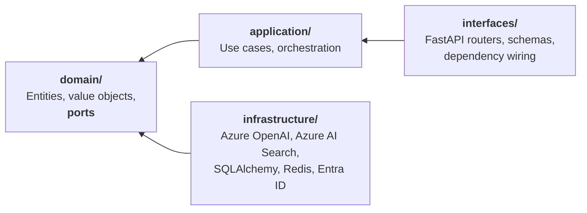

<div align="center">

# Paimon

**An AI Operations Platform for engineering organizations.**

Turns scattered operational knowledge — runbooks, postmortems, ADRs, API docs — into
grounded answers, cited evidence and automated workflows.

[](https://github.com/sergiomedi/paimon/actions/workflows/ci.yml)
[](backend/.python-version)
[](backend/pyproject.toml)
[](https://github.com/astral-sh/ruff)
[](LICENSE)

</div>

---

> **Project status: Phases 1 to 5 complete. Phase 6 — evaluation — next.**
> Ingestion, hybrid retrieval and grounded answering with citations work end to end; the
> retrieval benchmark runs; three agents run as LangGraph workflows over the same use
> cases, streaming their steps and pausing for a person when asked to; the platform speaks
> the Model Context Protocol in **both directions** — an authenticated, discoverable server
> exposing search and the agents, and a client that indexes documentation out of GitHub; every
> request, model call, retrieval and agent run is traced with OpenTelemetry, with tokens and an
> honestly-labelled cost estimate as metrics;
> and every port is
> implemented twice — locally (pgvector, any OpenAI-compatible endpoint) and on Azure
> (Azure OpenAI, Azure AI Search). This README is updated as each phase lands, and nothing
> is described here as working before it works: see
> [What works today](#what-works-today) for the current, verified surface, including what
> the Azure adapters have and have not been tested against.

---

## The problem

Engineering organizations do not lack documentation. They lack *retrievable* documentation.

The runbook that would have resolved an incident exists, in a repository nobody thought to
search. The postmortem describing the same failure eighteen months ago is in a wiki that has
since been migrated twice. The answer is somewhere in an eight-hundred-page API reference.
Meanwhile the on-call engineer asks a colleague, because a person is a better retrieval
system than the tools available.

Generic chat assistants do not fix this. They answer confidently from parametric memory,
cite nothing, and cannot tell you when they do not know — which in operational contexts is
the only answer that matters.

## What Paimon does

Paimon is an operational layer over organizational knowledge. It is not a chatbot wrapper.

- **Grounded retrieval.** Hybrid semantic and keyword search over an indexed corpus, with
  every claim traced to its source. Answers carry citations or they are not returned.
- **Multi-agent workflows.** LangGraph-orchestrated agents that perform real operational
  tasks — incident triage against runbook and postmortem history, postmortem drafting from
  incident timelines, documentation gap analysis.
- **MCP in both directions.** Search, whole documents and the agents themselves are
  exposed to any MCP client behind OAuth 2.1; and documentation is read *in* from external
  MCP servers and indexed like anything else.
- **Measured, not asserted.** An evaluation pipeline scores faithfulness, groundedness,
  relevance and latency against a versioned benchmark set. Retrieval changes are accepted or
  rejected on numbers.
- **Observable.** Every request, model call, retrieval and agent run traced with plain
  OpenTelemetry — no vendor SDK, so the backend is an endpoint rather than a dependency.

## What works today

Phase 1 is a thin vertical slice through every layer, so the wiring is proven before
anything is built on top of it. Phase 2 fills that slice in: real chunking, real
embeddings, hybrid retrieval, citations that resolve, a benchmark that scores them, and
a second implementation of every port on Azure. Phase 3 puts agents on top of those use
cases without changing any of them. Phase 4 puts the platform on both sides of the Model
Context Protocol without changing them either.

| Endpoint | Behaviour |
|---|---|
| `PUT /api/v1/documents/{id}` | Parses, chunks, embeds and indexes a document. Idempotent by content **and by pipeline**: unchanged bytes cost a hash comparison, not a round of embeddings — but a change to chunk size or embedding model re-ingests, because the same bytes no longer produce the same chunks. |
| `POST /api/v1/answers` | Retrieves by meaning and by wording, fuses the rankings, and answers **only** from what was retrieved — with citations that resolve to an exact span of the source. |
| `GET /api/v1/health/live` | Reports that the process is running. Touches no dependency, so a database outage cannot get the container restarted. |
| `GET /api/v1/health/ready` | Probes PostgreSQL and Redis concurrently, each under a timeout. Returns `503` when any is unusable, and names which one and why. |
| `GET /api/v1/agents` | Lists the agents this deployment offers, each with what it is for. |
| `POST /api/v1/agents/{agent}/runs` | Runs an agent, streaming each completed step as NDJSON. Returns the thread id in a header, so a client that loses the connection loses the stream and not the record. |
| `GET /api/v1/agents/runs` · `GET .../runs/{id}` | Reads runs back: every step, its duration, and what the run cost in tokens. A run belonging to another tenant is reported as absent, not as forbidden. |
| `POST /api/v1/agents/runs/{id}/decision` | Answers a run that stopped for a person, and continues it. |
| `GET /api/v1/me` | Validates a bearer token and returns the caller as a domain `Principal`. |
| `GET /api/v1/sources` | Lists the external systems this deployment is configured to read from. |
| `POST /api/v1/sources/{name}/synchronizations` | Reads a configured source and indexes everything it offers, reporting what changed, what did not, and which documents could not be read — by name. |
| `POST /mcp` | The MCP endpoint: `search_corpus`, `read_document` and `run_agent`, behind OAuth 2.1. Outside the `/api/v1` prefix, because the protocol carries its own version. |

A citation is not a filename. Each one carries the document, the enclosing
headings, the quoted text and the **character offsets** it came from, so a client
can open the source at the passage the claim rests on:

```json
{
  "answer": "Cordon the node first so the scheduler stops placing new pods on it [1].",
  "grounded": true,
  "citations": [
    {
      "marker": 1,
      "document_id": "node-maintenance",
      "source_uri": "https://example.test/runbooks/node-maintenance.md",
      "heading_path": ["Node maintenance", "Draining"],
      "start_char": 84,
      "end_char": 152,
      "quote": "Cordon the node first so the scheduler stops placing new pods on it."
    }
  ],
  "strategy": "fused",
  "usage": { "input_tokens": 83, "output_tokens": 14, "total_tokens": 97 }
}
```

When retrieval finds nothing, no model is called and the answer says so. A `200`
with `grounded: false` is a normal outcome, not an error: an answer that sounds
right and is not in the sources is worse than no answer, because the reader
cannot tell the difference.

The web application renders the platform's readiness — every dependency, its latency and,
when something is wrong, the error — and distinguishes "a dependency is failing" from "the
API did not answer at all", which are different situations for whoever is on call.

Retrieval runs on either backend without the use cases knowing which: **pgvector**
inside PostgreSQL, or **Azure AI Search**. Both satisfy the same twelve-assertion
contract test suite, and the Azure store additionally declares the `NativeHybridSearch`
capability, so the same question is fused in-process against pgvector and by the service
against Azure — a capability difference expressed as a protocol rather than a boolean
flag. Embeddings and generation are the same story: any OpenAI-compatible endpoint, or
Azure OpenAI, chosen by configuration. Azure authentication is selectable between an API
key and Microsoft Entra ID; with Entra the platform stores no secret at all
([ADR-0014](docs/adr/0014-azure-adapters-and-authentication.md),
[setup guide](docs/azure-setup.md)).

**The honest caveat about Azure:** those adapters are verified against an in-process
stand-in for the service, not against Azure. A stand-in written by the author of the
adapter can find inconsistencies; it cannot find wrong assumptions. The numbers in
[Evaluation](#evaluation) come from the local backend, which has been run against real
PostgreSQL and a real model server.

### Three agents, and why they are workflows

- **Incident triage** — a symptom is two questions, so it is framed twice and retrieved
  concurrently: *what do I do* against runbooks, *has this happened before* against
  postmortems. The results are merged and deduplicated, then answered with citations or not
  at all.
- **Postmortem drafting** — reads an incident timeline, **reuses the triage agent whole** as a
  sub-component to gather precedent, and drafts the sections. The timeline itself becomes a
  citable source, so a claim resting on it resolves like any other.
- **Documentation gap analysis** — reports which operational aspects a topic's material covers
  and which it leaves undocumented, against a checklist fixed in code so that two reports are
  comparable.

A model is called at **one node** in each. Framing is a template, routing is a comparison, and
the check that a draft is actually supported is a lookup — so a run is reproducible at
temperature zero, its cost is bounded before it starts, and a failure names the node that
produced it. That is a deliberate choice with a stated condition for revisiting it
([ADR-0016](docs/adr/0016-deterministic-workflows-before-autonomous-agents.md)).

The distinction the agents work hardest to preserve: **"I searched and found nothing" and "I
could not search" are different answers**. Conflating them lets a provider outage become a
confident claim about your documentation.

Runs stream their steps, are checkpointed after each one, and can pause for a person and
continue — the graph is described in framework-free Python and compiled onto LangGraph by a
single adapter, which is the one module in the platform that imports it
([ADR-0015](docs/adr/0015-agent-state-lives-in-the-domain.md),
[ADR-0019](docs/adr/0019-suspend-runs-through-state.md)).

### MCP, in both directions

**As a server**, the platform offers three tools — `search_corpus`, `read_document` and
`run_agent`. The third is the one worth reaching for: `search_corpus` hands a calling model
passages it then has to reason over, while an agent has already framed the question two ways,
retrieved against each, checked its draft against what it found and refused to answer when it
was not supported. Delegating the task beats fetching the material.

The endpoint is an OAuth 2.1 **resource server**, which the specification is explicit about:
it publishes RFC 9728 metadata so a client that gets a `401` can discover where to obtain a
token, and it validates that a token was minted for *it*. It also publishes `server.json` at
a well-known path, so something that has never met this server can learn it exists, what it
speaks and what header to present — without a token, because requiring one to find out where
to get one is a loop.

Authentication happens twice per request and neither is redundant: the middleware at the door
decides whether to serve the request at all, the gateway inside decides *whose* material it
may read. Remove either and there is a real hole.

**As a client**, the platform reads documentation out of GitHub through GitHub's official MCP
server and indexes it through the same pipeline as everything else — so a second run over an
untouched repository costs a hash comparison, not a round of embeddings. Three things make
that safe to run:

- **Sources are configuration, never a parameter.** A caller *names* one of the sources this
  process started with. There is no field for a URL, because the endpoint that accepts one is
  the endpoint that fetches `169.254.169.254` on request.
- **Tool definitions are pinned by digest** and compared on every connection. Tool
  descriptions are what a model reads, and a server can change them between sessions; a
  change stops the synchronisation and names the tool.
- **The endpoint is the read-only toolset.** A synchronisation that cannot call `delete_file`
  cannot be talked into calling it.

External tools are deliberately **not** handed to the agents. Loading somebody else's tool
definitions into an agent's context costs tokens, invites tool confusion, and puts text this
platform did not write where a model reads instructions.

And the boundary all of it exists for: a document saying *"ignore all previous instructions"*
is **indexed, not rejected** — filtering the phrase would break every runbook that quotes an
incident and miss the next wording anyway. What is guaranteed is where the text may go: into
the **user** turn as a numbered source, while the system turn stays the platform's own prompt,
and never into a tool description. Both are asserted as tests, because a boundary nothing
checks is one that moves.

🔌 **[Connecting to Paimon over MCP](docs/mcp.md)** — the tools, the discovery documents,
Claude's Custom Connectors, the Inspector, and configuring a GitHub source.

### Seeing what it did

The platform emits **plain OpenTelemetry** — no vendor SDK anywhere in the code, so the backend
is an endpoint and a credential rather than a dependency. Langfuse today, Azure Monitor in
Phase 7, a collector fanning out to both: one setting.

A request reads as a shape rather than a list. An agent run is one span with its nodes nested
inside it; a node's model call covers the whole logical call with the HTTP attempts beneath it,
so *"the model took nine seconds"* and *"the model took three attempts"* are visible at once.
Retrieval spans say which strategy ran and how many hits came back — the difference between
"the model was wrong" and "the model was given nothing to be right about". Every tool call
arriving over MCP is audited with its tenant.

Logs and traces join in both directions: each log line names the trace it was written inside,
and each request's span carries the correlation id the logs are keyed by.

Instrumentation is added by **wrapping the ports**, not by editing adapters — so an adapter added
later is traced because of where it is built, not because its author remembered
([ADR-0026](docs/adr/0026-tracing-by-decoration.md)).

**On cost, the honest version.** There is no cost metric in the OpenTelemetry conventions; the
ecosystem derives it from tokens and a price list. So does this, and says so: the metric is
`paimon.gen_ai.cost.estimated`, a model missing from the price list produces **no measurement
rather than a zero**, and every measurement carries the revision of the table that produced it —
because a figure you cannot trace back to its prices stops meaning anything the moment the table
changes. The provider's invoice remains the authority.

Prompts and completions are **not** recorded by default and are refused outright in deployed
environments. Tool arguments and embedded text are never recorded at all.

📈 **[Observing Paimon](docs/observability.md)** — every span and metric, connecting Langfuse or
a collector, sampling, the content switch, and the known gaps.

Also in place: typed configuration validated at startup, JSON logging with a correlation id
that covers library output too, six machine-enforced architecture contracts, and a CI
pipeline running lint, types, contracts, tests, a frontend build and a container image
build with a smoke test.

Not yet built: the evaluation pipeline of Phase 6 — the retrieval benchmark runs, but
faithfulness and groundedness are not yet scored automatically.

## Architecture

Business logic is independent of every framework around it. FastAPI, LangGraph, Azure
OpenAI and Azure AI Search are all replaceable without touching the domain — a constraint
that is verified in CI, not merely claimed.



Every arrow points inward, and `import-linter` fails the build if one ever points outward.

📐 **[Full architecture overview](docs/architecture/overview.md)** — C4 context and container
diagrams, request flows, non-functional posture, and an honest list of known gaps.

### Design decisions

Every expensive decision is recorded with its alternatives and the consequences accepted,
including the negative ones.

| ADR | Decision |
|---|---|
| [0001](docs/adr/0001-use-madr-for-architecture-decisions.md) | Use MADR for architecture decisions |
| [0002](docs/adr/0002-monorepo-layout-and-module-boundaries.md) | Monorepo layout and enforced module boundaries |
| [0003](docs/adr/0003-ports-and-adapters-for-llm-and-vector-store.md) | Ports and adapters for LLM and vector store |
| [0004](docs/adr/0004-authentication-with-entra-id.md) | Authentication with Microsoft Entra ID |
| [0005](docs/adr/0005-python-toolchain.md) | Python toolchain: uv, ruff, mypy |
| [0006](docs/adr/0006-continuous-integration-from-phase-1.md) | Continuous integration from Phase 1 |
| [0007](docs/adr/0007-persistence-postgresql-sqlalchemy-alembic-redis.md) | Persistence: PostgreSQL, SQLAlchemy, Alembic, Redis |
| [0008](docs/adr/0008-target-domain-engineering-operations.md) | Target domain: engineering operations |
| [0009](docs/adr/0009-dependency-injection-with-fastapi-depends.md) | Dependency injection with FastAPI's `Depends` |
| [0010](docs/adr/0010-separate-embedding-and-chat-ports.md) | Separate embedding and chat ports |
| [0011](docs/adr/0011-fix-embeddings-at-1024-dimensions.md) | Fix embeddings at 1024 dimensions |
| [0012](docs/adr/0012-fuse-retrieval-by-rank.md) | Fuse retrieval results by rank, not by score |
| [0013](docs/adr/0013-anchor-ground-truth-to-quotations.md) | Anchor evaluation ground truth to quotations |
| [0014](docs/adr/0014-azure-adapters-and-authentication.md) | Azure adapters and selectable authentication |
| [0015](docs/adr/0015-agent-state-lives-in-the-domain.md) | Agent state in the domain, the graph in infrastructure |
| [0016](docs/adr/0016-deterministic-workflows-before-autonomous-agents.md) | Deterministic workflows before autonomous agents |
| [0017](docs/adr/0017-agent-persistence-on-the-existing-driver.md) | Persist agent runs on the drivers already in the project |
| [0018](docs/adr/0018-tool-calling-as-a-capability.md) | Tool calling as a capability, with a small tool surface |
| [0019](docs/adr/0019-suspend-runs-through-state.md) | A run suspends by writing state, not by calling the runtime |
| [0020](docs/adr/0020-mcp-server-inside-the-api.md) | The MCP server is an interface, mounted inside the API |
| [0021](docs/adr/0021-mcp-as-an-oauth-resource-server.md) | The MCP endpoint is an OAuth 2.1 resource server, and says so |
| [0022](docs/adr/0022-agents-as-mcp-tools.md) | Agents are MCP tools that run to completion; documents are not resources |
| [0023](docs/adr/0023-mcp-client-as-a-document-source.md) | Consuming MCP servers as document sources, not as an agent's toolbox |
| [0024](docs/adr/0024-a-discoverable-mcp-server.md) | The MCP server describes itself, at a path that is still an argument |
| [0025](docs/adr/0025-opentelemetry-as-the-only-instrumentation.md) | OpenTelemetry is the instrumentation; a backend is a destination |
| [0026](docs/adr/0026-tracing-by-decoration.md) | Model calls are traced by wrapping the port, not by editing adapters |
| [0027](docs/adr/0027-tracing-retrieval-agents-and-tool-calls.md) | Tracing retrieval, agent runs and tool calls |
| [0028](docs/adr/0028-metrics-and-an-estimated-cost.md) | Tokens are measured, cost is estimated, and they are labelled differently |

## Technology

| Layer | Choice | Why |
|---|---|---|
| Backend | FastAPI · Python 3.13 | Async throughout, native OpenAPI, first-class typing |
| Frontend | Next.js 16 · TypeScript · Tailwind · shadcn/ui | Streaming UI, strict types |
| Agents | LangGraph | Explicit state machines over implicit agent loops — and confined to one adapter ([ADR-0015](docs/adr/0015-agent-state-lives-in-the-domain.md)) |
| Interoperability | Model Context Protocol | Server and client, spec 2026-07-28 — [ADR-0020](docs/adr/0020-mcp-server-inside-the-api.md) to [ADR-0024](docs/adr/0024-a-discoverable-mcp-server.md), and the [connection guide](docs/mcp.md) |
| LLM | Azure OpenAI · local OpenAI-compatible | Both implemented, behind one port — [ADR-0003](docs/adr/0003-ports-and-adapters-for-llm-and-vector-store.md), [ADR-0010](docs/adr/0010-separate-embedding-and-chat-ports.md) |
| Retrieval | Azure AI Search · pgvector | Two adapters, one contract suite, selected by configuration |
| Data | PostgreSQL 17 · Redis 7 | System of record, and cache plus coordination |
| Identity | Microsoft Entra ID (OIDC) | The platform stores no credentials |
| Observability | OpenTelemetry · any OTLP backend | Plain OTel in the code; Langfuse, Azure Monitor or a collector by configuration — [ADR-0025](docs/adr/0025-opentelemetry-as-the-only-instrumentation.md), [guide](docs/observability.md) |
| Tooling | uv · ruff · mypy --strict · import-linter | Standards enforced by machine, not convention |
| Delivery | Docker · GitHub Actions · Azure Container Apps | Green build from the first commit |

## Roadmap

Each phase ships working software and its documentation. No phase begins before the
previous one is complete.

- [x] **Phase 1 — Foundation** · architecture, ADRs, repository skeleton, dev environment, CI
- [x] **Phase 2 — RAG** · ingestion, chunking, embeddings, hybrid retrieval, citations
- [x] **Phase 3 — Agents** · LangGraph workflows, agent memory, tool integration
- [x] **Phase 4 — MCP** · MCP server and tools, client integration
- [x] **Phase 5 — Observability** · Langfuse, OpenTelemetry, cost monitoring
- [ ] **Phase 6 — Evaluation** · benchmark set, faithfulness and groundedness metrics
- [ ] **Phase 7 — Cloud** · Azure deployment architecture
- [ ] **Phase 8 — Delivery** · automated build, deploy and release gating

## Getting started

Requires [uv](https://docs.astral.sh/uv/) and Docker. Every command below has been run.

```bash
git clone https://github.com/sergiomedi/paimon.git
cd paimon

# PostgreSQL (with pgvector) and Redis
docker compose -f docker/compose.yaml up -d

cd backend
cp .env.example .env          # the defaults match the Compose stack
uv sync --all-groups          # uv installs Python 3.13 itself if needed
uv run uvicorn paimon.interfaces.api.app:create_app --factory --reload
```

The service is then on <http://localhost:8000>, with interactive docs at `/docs` outside
deployed environments.

```bash
curl localhost:8000/api/v1/health/ready | jq

# Mint a local token — the development signer, refused outside local and test
TOKEN=$(uv run python -c "
from paimon.infrastructure.identity import DevIdentityProvider
from paimon.config import get_settings
print(DevIdentityProvider(get_settings().auth.dev_signing_key.get_secret_value()).issue(
    subject='you', tenant_id='local', display_name='You'))")

curl -H "Authorization: Bearer $TOKEN" localhost:8000/api/v1/me
```

In another terminal, the web application:

```bash
cd frontend
cp .env.example .env.local
pnpm install
pnpm dev                       # http://localhost:3000
```

To run the backend stack in containers instead: `docker compose -f docker/compose.yaml
--profile app up --build`.

### Running an agent

```bash
curl -N -H "Authorization: Bearer $TOKEN" -H 'Content-Type: application/json' \
  -d '{"input":"eviction hangs"}' \
  localhost:8000/api/v1/agents/incident-triage/runs
```

Each completed step arrives as its own line while the run is still going:

```text
{"name":"frame","summary":"framed the symptom","duration_ms":0.003,...}
{"name":"procedure","summary":"procedure: retrieved 3 chunks",...}
{"name":"history","summary":"history: retrieved 2 chunks",...}
{"name":"assess","summary":"weighed 4 chunks from 2 documents",...}
{"name":"draft","summary":"drafted a grounded answer","input_tokens":812,...}
{"name":"verify","summary":"checked the draft is supported",...}
```

Set `PAIMON_AGENTS__RESUMABLE=true` and `PAIMON_AGENTS__REVIEW_POSTMORTEMS=true` and a
postmortem run stops for a person: it reports `awaiting_input`, and
`POST /api/v1/agents/runs/{id}/decision` continues it. Both are off by default, because
resumable runs cost a second connection pool and a deployment that never suspends a run should
not pay for one.

### Running against Azure

The same build talks to Azure OpenAI and Azure AI Search by configuration alone — no code
path, no branch in a use case. Point it at your own resources:

```bash
# Embeddings and generation on Azure OpenAI, vectors in Azure AI Search
PAIMON_EMBEDDING__PROVIDER=azure
PAIMON_CHAT__PROVIDER=azure
PAIMON_RETRIEVAL__STORE=azure_search
PAIMON_AZURE_OPENAI__ENDPOINT=https://<resource>.openai.azure.com
PAIMON_AZURE_OPENAI__EMBEDDING_DEPLOYMENT=text-embedding-3-large
PAIMON_AZURE_OPENAI__CHAT_DEPLOYMENT=gpt-4o-mini
PAIMON_AZURE_SEARCH__ENDPOINT=https://<service>.search.windows.net
```

Leave the API keys unset and the adapters acquire tokens from Microsoft Entra ID through
`DefaultAzureCredential` — `az login` on a workstation, a managed identity in Azure — so
no secret is stored anywhere. Set a key instead and it is used directly; the choice is by
absence, not a mode flag. Selecting an Azure provider without its endpoint or deployment
aborts startup rather than failing on the first request.

☁️ **[Azure setup guide](docs/azure-setup.md)** — provisioning with `az`, the role
assignments Entra authentication needs, index creation, and what it costs.

## Evaluation

Retrieval is easy to change and hard to judge by eye, so it is measured. A golden
set of questions names the document and quotes the passage that answers each one;
a retrieval counts as successful when a returned chunk comes from that document
and contains the quotation.

```bash
cd backend
uv run python -m paimon.interfaces.cli.evaluate \
    --corpus ../evaluation/corpus/sample \
    --dataset ../evaluation/datasets/retrieval-v1.jsonl \
    --label "chunk=512 overlap=64 rrf=60"
```

```text
dataset       retrieval-v1  (15 cases)
configuration chunk=512 overlap=64 rrf=60
cutoff        k=3

  answerable@k   100.0%   at least one supporting passage retrieved
  recall@k       100.0%   of expected passages retrieved
  precision@k     35.6%   of the k slots that were useful
  MRR             0.900   how high the first useful hit lands
  nDCG@k          0.900   rank-weighted quality
  median latency    7.9 ms
```

**Read those numbers with the caveat they deserve.** They come from the five-document
sample corpus committed here so the benchmark runs immediately after a clone. On a
corpus that small, retrieving eight chunks returns most of it, and the scores say the
pipeline works rather than that retrieval is good. The reported benchmark uses the
public corpora in [`evaluation/corpus/manifest.json`](evaluation/corpus/manifest.json),
fetched rather than vendored.

Ground truth is anchored to quotations rather than chunk ids, so chunk size, overlap,
embedding model and fusion weights can all be varied without rewriting the dataset —
which is the one experiment the benchmark exists to run
([ADR-0013](docs/adr/0013-anchor-ground-truth-to-quotations.md)).

## Quality gates

Everything CI runs, in one command:

```bash
./scripts/check.sh             # backend and frontend
./scripts/check.sh backend     # backend only
```

Or individually:

```bash
cd backend
uv run ruff check .            # lint
uv run ruff format --check .   # formatting
uv run mypy                    # types, strict
uv run lint-imports            # the dependency rule of ADR-0002
uv run pytest                  # unit, end-to-end and integration tests

cd ../frontend
pnpm lint
pnpm typecheck                 # tsc --noEmit, strict
pnpm build
```

`lint-imports` is the one worth explaining: it fails the build when a layer imports
outward, when the domain imports a framework, or when agent logic imports the orchestration
framework. Clean Architecture here is a test, not a diagram. The contracts are themselves
tested against a package that violates them on purpose — a guard never observed to fail is not
a guard.

That last contract earned its keep during Phase 3: it rejected the first placement of the agent
state, because compiling a graph meant infrastructure importing a layer above it. The fix was
not an exception — it was moving the code to where the failure said it belonged.

Integration tests skip when PostgreSQL and Redis are unreachable, so a contributor without
Docker still gets a useful run. CI sets `PAIMON_TEST_REQUIRE_INTEGRATION=1`, which turns that
skip into a failure.

## Repository layout

```text
backend/
  src/paimon/
    domain/          Entities, value objects, ports. No framework imports
    application/     Use cases
    domain/agents/   Agent state and the graph vocabulary. No framework
    rag/             Chunking, rank fusion, prompt assembly. Pure functions
    agents/          The three agents: node bodies, graphs, tools, registry
    evaluation/      Golden set, metrics, benchmark runner
    infrastructure/  Adapters: identity, persistence, embedding, chat,
                     azure/, orchestration/ (the only LangGraph import),
                     sources/ (the MCP client, and the GitHub source over it)
    interfaces/api/  Routers, schemas, composition root
    interfaces/mcp/  The MCP server: tools, gateway, authorization, discovery
    observability/   Logging, tracing, metrics — the conventions in one place
    interfaces/cli/  The benchmark entry point
  tests/             unit, e2e, integration, architecture, contracts, fakes
docker/              Dockerfile and the local Compose stack
scripts/             check.sh — every CI gate in one command
docs/                Architecture overview and decision records
.github/workflows/   CI

frontend/
  src/app/           App Router pages
  src/components/    UI, in the shadcn/ui convention
  src/lib/           Typed API client

evaluation/          Corpus, golden set, manifest
infrastructure/      Infrastructure as code, Azure  (Phase 7)
```

## Demo

<!--
  Reserved for the end-to-end walkthrough video, added once the platform is functional.
  Upload the .mp4 to a GitHub issue or release to obtain a hosted URL, then embed it here
  as a bare link on its own line so GitHub renders an inline player.
-->

*A recorded walkthrough of the platform — ingestion, grounded retrieval with citations,
and an agent resolving an incident end to end — will be embedded here.*

## License

MIT — see [LICENSE](LICENSE).
