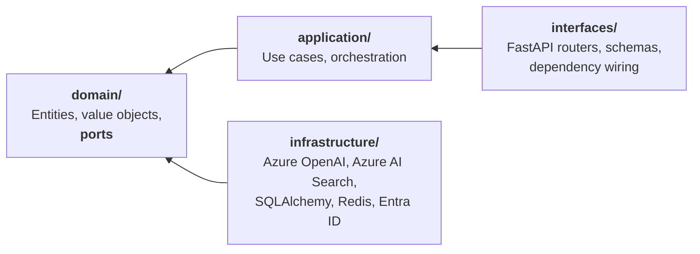

<div align="center">

# Paimon

**An AI Operations Platform for engineering organizations.**

Turns scattered operational knowledge — runbooks, postmortems, ADRs, API docs — into
grounded answers, cited evidence and automated workflows.

[](https://github.com/sergiomedi/paimon/actions/workflows/ci.yml)
[](backend/.python-version)
[](backend/pyproject.toml)
[](https://github.com/astral-sh/ruff)
[](LICENSE)

</div>

---

> **Project status: Phases 1 and 2 complete. Phase 3 — agents — next.**
> Ingestion, hybrid retrieval and grounded answering with citations work end to end,
> the retrieval benchmark runs, and the same ports are implemented twice: locally
> (pgvector, any OpenAI-compatible endpoint) and on Azure (Azure OpenAI, Azure AI
> Search). This README is updated as each phase lands, and nothing is described here as
> working before it works: see [What works today](#what-works-today) for the current,
> verified surface — including what the Azure adapters have and have not been tested
> against.

---

## The problem

Engineering organizations do not lack documentation. They lack *retrievable* documentation.

The runbook that would have resolved an incident exists, in a repository nobody thought to
search. The postmortem describing the same failure eighteen months ago is in a wiki that has
since been migrated twice. The answer is somewhere in an eight-hundred-page API reference.
Meanwhile the on-call engineer asks a colleague, because a person is a better retrieval
system than the tools available.

Generic chat assistants do not fix this. They answer confidently from parametric memory,
cite nothing, and cannot tell you when they do not know — which in operational contexts is
the only answer that matters.

## What Paimon does

Paimon is an operational layer over organizational knowledge. It is not a chatbot wrapper.

- **Grounded retrieval.** Hybrid semantic and keyword search over an indexed corpus, with
  every claim traced to its source. Answers carry citations or they are not returned.
- **Multi-agent workflows.** LangGraph-orchestrated agents that perform real operational
  tasks — incident triage against runbook and postmortem history, postmortem drafting from
  incident timelines, documentation gap analysis.
- **MCP integration.** Platform capabilities exposed over the Model Context Protocol, so
  the same tools are reachable from any MCP-capable client.
- **Measured, not asserted.** An evaluation pipeline scores faithfulness, groundedness,
  relevance and latency against a versioned benchmark set. Retrieval changes are accepted or
  rejected on numbers.
- **Observable.** Every LLM call traced, with token cost attributed per request.

## What works today

Phase 1 is a thin vertical slice through every layer, so the wiring is proven before
anything is built on top of it. Phase 2 fills that slice in: real chunking, real
embeddings, hybrid retrieval, citations that resolve, a benchmark that scores them, and
a second implementation of every port on Azure.

| Endpoint | Behaviour |
|---|---|
| `PUT /api/v1/documents/{id}` | Parses, chunks, embeds and indexes a document. Idempotent by content **and by pipeline**: unchanged bytes cost a hash comparison, not a round of embeddings — but a change to chunk size or embedding model re-ingests, because the same bytes no longer produce the same chunks. |
| `POST /api/v1/answers` | Retrieves by meaning and by wording, fuses the rankings, and answers **only** from what was retrieved — with citations that resolve to an exact span of the source. |
| `GET /api/v1/health/live` | Reports that the process is running. Touches no dependency, so a database outage cannot get the container restarted. |
| `GET /api/v1/health/ready` | Probes PostgreSQL and Redis concurrently, each under a timeout. Returns `503` when any is unusable, and names which one and why. |
| `GET /api/v1/me` | Validates a bearer token and returns the caller as a domain `Principal`. |

A citation is not a filename. Each one carries the document, the enclosing
headings, the quoted text and the **character offsets** it came from, so a client
can open the source at the passage the claim rests on:

```json
{
  "answer": "Cordon the node first so the scheduler stops placing new pods on it [1].",
  "grounded": true,
  "citations": [
    {
      "marker": 1,
      "document_id": "node-maintenance",
      "source_uri": "https://example.test/runbooks/node-maintenance.md",
      "heading_path": ["Node maintenance", "Draining"],
      "start_char": 84,
      "end_char": 152,
      "quote": "Cordon the node first so the scheduler stops placing new pods on it."
    }
  ],
  "strategy": "fused",
  "usage": { "input_tokens": 83, "output_tokens": 14, "total_tokens": 97 }
}
```

When retrieval finds nothing, no model is called and the answer says so. A `200`
with `grounded: false` is a normal outcome, not an error: an answer that sounds
right and is not in the sources is worse than no answer, because the reader
cannot tell the difference.

The web application renders the platform's readiness — every dependency, its latency and,
when something is wrong, the error — and distinguishes "a dependency is failing" from "the
API did not answer at all", which are different situations for whoever is on call.

Retrieval runs on either backend without the use cases knowing which: **pgvector**
inside PostgreSQL, or **Azure AI Search**. Both satisfy the same twelve-assertion
contract test suite, and the Azure store additionally declares the `NativeHybridSearch`
capability, so the same question is fused in-process against pgvector and by the service
against Azure — a capability difference expressed as a protocol rather than a boolean
flag. Embeddings and generation are the same story: any OpenAI-compatible endpoint, or
Azure OpenAI, chosen by configuration. Azure authentication is selectable between an API
key and Microsoft Entra ID; with Entra the platform stores no secret at all
([ADR-0014](docs/adr/0014-azure-adapters-and-authentication.md),
[setup guide](docs/azure-setup.md)).

**The honest caveat about Azure:** those adapters are verified against an in-process
stand-in for the service, not against Azure. A stand-in written by the author of the
adapter can find inconsistencies; it cannot find wrong assumptions. The numbers in
[Evaluation](#evaluation) come from the local backend, which has been run against real
PostgreSQL and a real model server.

Also in place: typed configuration validated at startup, JSON logging with a correlation id
that covers library output too, five machine-enforced architecture contracts, and a CI
pipeline running lint, types, contracts, tests, a frontend build and a container image
build with a smoke test.

Not yet built: agents, MCP and observability — Phases 3 to 5.

## Architecture

Business logic is independent of every framework around it. FastAPI, LangGraph, Azure
OpenAI and Azure AI Search are all replaceable without touching the domain — a constraint
that is verified in CI, not merely claimed.



Every arrow points inward, and `import-linter` fails the build if one ever points outward.

📐 **[Full architecture overview](docs/architecture/overview.md)** — C4 context and container
diagrams, request flows, non-functional posture, and an honest list of known gaps.

### Design decisions

Every expensive decision is recorded with its alternatives and the consequences accepted,
including the negative ones.

| ADR | Decision |
|---|---|
| [0001](docs/adr/0001-use-madr-for-architecture-decisions.md) | Use MADR for architecture decisions |
| [0002](docs/adr/0002-monorepo-layout-and-module-boundaries.md) | Monorepo layout and enforced module boundaries |
| [0003](docs/adr/0003-ports-and-adapters-for-llm-and-vector-store.md) | Ports and adapters for LLM and vector store |
| [0004](docs/adr/0004-authentication-with-entra-id.md) | Authentication with Microsoft Entra ID |
| [0005](docs/adr/0005-python-toolchain.md) | Python toolchain: uv, ruff, mypy |
| [0006](docs/adr/0006-continuous-integration-from-phase-1.md) | Continuous integration from Phase 1 |
| [0007](docs/adr/0007-persistence-postgresql-sqlalchemy-alembic-redis.md) | Persistence: PostgreSQL, SQLAlchemy, Alembic, Redis |
| [0008](docs/adr/0008-target-domain-engineering-operations.md) | Target domain: engineering operations |
| [0009](docs/adr/0009-dependency-injection-with-fastapi-depends.md) | Dependency injection with FastAPI's `Depends` |
| [0010](docs/adr/0010-separate-embedding-and-chat-ports.md) | Separate embedding and chat ports |
| [0011](docs/adr/0011-fix-embeddings-at-1024-dimensions.md) | Fix embeddings at 1024 dimensions |
| [0012](docs/adr/0012-fuse-retrieval-by-rank.md) | Fuse retrieval results by rank, not by score |
| [0013](docs/adr/0013-anchor-ground-truth-to-quotations.md) | Anchor evaluation ground truth to quotations |
| [0014](docs/adr/0014-azure-adapters-and-authentication.md) | Azure adapters and selectable authentication |

## Technology

| Layer | Choice | Why |
|---|---|---|
| Backend | FastAPI · Python 3.13 | Async throughout, native OpenAPI, first-class typing |
| Frontend | Next.js 16 · TypeScript · Tailwind · shadcn/ui | Streaming UI, strict types |
| Agents | LangGraph | Explicit state machines over implicit agent loops |
| LLM | Azure OpenAI · local OpenAI-compatible | Both implemented, behind one port — [ADR-0003](docs/adr/0003-ports-and-adapters-for-llm-and-vector-store.md), [ADR-0010](docs/adr/0010-separate-embedding-and-chat-ports.md) |
| Retrieval | Azure AI Search · pgvector | Two adapters, one contract suite, selected by configuration |
| Data | PostgreSQL 17 · Redis 7 | System of record, and cache plus coordination |
| Identity | Microsoft Entra ID (OIDC) | The platform stores no credentials |
| Observability | Langfuse · OpenTelemetry | Traces, latency, token cost per request |
| Tooling | uv · ruff · mypy --strict · import-linter | Standards enforced by machine, not convention |
| Delivery | Docker · GitHub Actions · Azure Container Apps | Green build from the first commit |

## Roadmap

Each phase ships working software and its documentation. No phase begins before the
previous one is complete.

- [x] **Phase 1 — Foundation** · architecture, ADRs, repository skeleton, dev environment, CI
- [x] **Phase 2 — RAG** · ingestion, chunking, embeddings, hybrid retrieval, citations
- [ ] **Phase 3 — Agents** · LangGraph workflows, agent memory, tool integration
- [ ] **Phase 4 — MCP** · MCP server and tools, client integration
- [ ] **Phase 5 — Observability** · Langfuse, OpenTelemetry, cost monitoring
- [ ] **Phase 6 — Evaluation** · benchmark set, faithfulness and groundedness metrics
- [ ] **Phase 7 — Cloud** · Azure deployment architecture
- [ ] **Phase 8 — Delivery** · automated build, deploy and release gating

## Getting started

Requires [uv](https://docs.astral.sh/uv/) and Docker. Every command below has been run.

```bash
git clone https://github.com/sergiomedi/paimon.git
cd paimon

# PostgreSQL (with pgvector) and Redis
docker compose -f docker/compose.yaml up -d

cd backend
cp .env.example .env          # the defaults match the Compose stack
uv sync --all-groups          # uv installs Python 3.13 itself if needed
uv run uvicorn paimon.interfaces.api.app:create_app --factory --reload
```

The service is then on <http://localhost:8000>, with interactive docs at `/docs` outside
deployed environments.

```bash
curl localhost:8000/api/v1/health/ready | jq

# Mint a local token — the development signer, refused outside local and test
TOKEN=$(uv run python -c "
from paimon.infrastructure.identity import DevIdentityProvider
from paimon.config import get_settings
print(DevIdentityProvider(get_settings().auth.dev_signing_key.get_secret_value()).issue(
    subject='you', tenant_id='local', display_name='You'))")

curl -H "Authorization: Bearer $TOKEN" localhost:8000/api/v1/me
```

In another terminal, the web application:

```bash
cd frontend
cp .env.example .env.local
pnpm install
pnpm dev                       # http://localhost:3000
```

To run the backend stack in containers instead: `docker compose -f docker/compose.yaml
--profile app up --build`.

### Running against Azure

The same build talks to Azure OpenAI and Azure AI Search by configuration alone — no code
path, no branch in a use case. Point it at your own resources:

```bash
# Embeddings and generation on Azure OpenAI, vectors in Azure AI Search
PAIMON_EMBEDDING__PROVIDER=azure
PAIMON_CHAT__PROVIDER=azure
PAIMON_RETRIEVAL__STORE=azure_search
PAIMON_AZURE_OPENAI__ENDPOINT=https://<resource>.openai.azure.com
PAIMON_AZURE_OPENAI__EMBEDDING_DEPLOYMENT=text-embedding-3-large
PAIMON_AZURE_OPENAI__CHAT_DEPLOYMENT=gpt-4o-mini
PAIMON_AZURE_SEARCH__ENDPOINT=https://<service>.search.windows.net
```

Leave the API keys unset and the adapters acquire tokens from Microsoft Entra ID through
`DefaultAzureCredential` — `az login` on a workstation, a managed identity in Azure — so
no secret is stored anywhere. Set a key instead and it is used directly; the choice is by
absence, not a mode flag. Selecting an Azure provider without its endpoint or deployment
aborts startup rather than failing on the first request.

☁️ **[Azure setup guide](docs/azure-setup.md)** — provisioning with `az`, the role
assignments Entra authentication needs, index creation, and what it costs.

## Evaluation

Retrieval is easy to change and hard to judge by eye, so it is measured. A golden
set of questions names the document and quotes the passage that answers each one;
a retrieval counts as successful when a returned chunk comes from that document
and contains the quotation.

```bash
cd backend
uv run python -m paimon.interfaces.cli.evaluate \
    --corpus ../evaluation/corpus/sample \
    --dataset ../evaluation/datasets/retrieval-v1.jsonl \
    --label "chunk=512 overlap=64 rrf=60"
```

```text
dataset       retrieval-v1  (15 cases)
configuration chunk=512 overlap=64 rrf=60
cutoff        k=3

  answerable@k   100.0%   at least one supporting passage retrieved
  recall@k       100.0%   of expected passages retrieved
  precision@k     35.6%   of the k slots that were useful
  MRR             0.900   how high the first useful hit lands
  nDCG@k          0.900   rank-weighted quality
  median latency    7.9 ms
```

**Read those numbers with the caveat they deserve.** They come from the five-document
sample corpus committed here so the benchmark runs immediately after a clone. On a
corpus that small, retrieving eight chunks returns most of it, and the scores say the
pipeline works rather than that retrieval is good. The reported benchmark uses the
public corpora in [`evaluation/corpus/manifest.json`](evaluation/corpus/manifest.json),
fetched rather than vendored.

Ground truth is anchored to quotations rather than chunk ids, so chunk size, overlap,
embedding model and fusion weights can all be varied without rewriting the dataset —
which is the one experiment the benchmark exists to run
([ADR-0013](docs/adr/0013-anchor-ground-truth-to-quotations.md)).

## Quality gates

Everything CI runs, in one command:

```bash
./scripts/check.sh             # backend and frontend
./scripts/check.sh backend     # backend only
```

Or individually:

```bash
cd backend
uv run ruff check .            # lint
uv run ruff format --check .   # formatting
uv run mypy                    # types, strict
uv run lint-imports            # the dependency rule of ADR-0002
uv run pytest                  # unit, end-to-end and integration tests

cd ../frontend
pnpm lint
pnpm typecheck                 # tsc --noEmit, strict
pnpm build
```

`lint-imports` is the one worth explaining: it fails the build when a layer imports
outward, or when the domain imports a framework. Clean Architecture here is a test, not a
diagram. The contracts are themselves tested against a package that violates them on
purpose — a guard never observed to fail is not a guard.

Integration tests skip when PostgreSQL and Redis are unreachable, so a contributor without
Docker still gets a useful run. CI sets `PAIMON_TEST_REQUIRE_INTEGRATION=1`, which turns that
skip into a failure.

## Repository layout

```text
backend/
  src/paimon/
    domain/          Entities, value objects, ports. No framework imports
    application/     Use cases
    rag/             Chunking, rank fusion, prompt assembly. Pure functions
    evaluation/      Golden set, metrics, benchmark runner
    infrastructure/  Adapters: identity, persistence, embedding, chat, azure/
    interfaces/api/  Routers, schemas, composition root
    interfaces/cli/  The benchmark entry point
  tests/             unit, e2e, integration, architecture, contracts, fakes
docker/              Dockerfile and the local Compose stack
scripts/             check.sh — every CI gate in one command
docs/                Architecture overview and decision records
.github/workflows/   CI

frontend/
  src/app/           App Router pages
  src/components/    UI, in the shadcn/ui convention
  src/lib/           Typed API client

evaluation/          Corpus, golden set, manifest
infrastructure/      Infrastructure as code, Azure  (Phase 7)
```

`agents/` joins the backend package in Phase 3.

## Demo

<!--
  Reserved for the end-to-end walkthrough video, added once the platform is functional.
  Upload the .mp4 to a GitHub issue or release to obtain a hosted URL, then embed it here
  as a bare link on its own line so GitHub renders an inline player.
-->

*A recorded walkthrough of the platform — ingestion, grounded retrieval with citations,
and an agent resolving an incident end to end — will be embedded here.*

## License

MIT — see [LICENSE](LICENSE).
