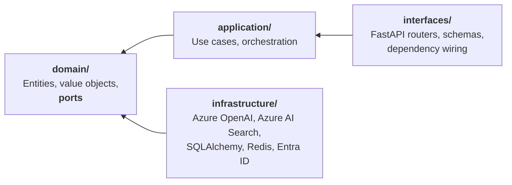

<div align="center">

# Paimon

**An AI Operations Platform for engineering organizations.**

Turns scattered operational knowledge — runbooks, postmortems, ADRs, API docs — into
grounded answers, cited evidence and automated workflows.

[](https://github.com/sergiomedi/paimon/actions/workflows/ci.yml)
[](backend/.python-version)
[](backend/pyproject.toml)
[](https://github.com/astral-sh/ruff)
[](LICENSE)

</div>

---

> **Project status: Phase 1 of 8 — Foundation, complete.**
> Architecture, decision records, the backend skeleton, the frontend and CI are in place.
> Phase 2 — the RAG system — is next. This README is updated as each phase lands, and
> nothing is described here as working before it works: see
> [What works today](#what-works-today) for the current, verified surface.

---

## The problem

Engineering organizations do not lack documentation. They lack *retrievable* documentation.

The runbook that would have resolved an incident exists, in a repository nobody thought to
search. The postmortem describing the same failure eighteen months ago is in a wiki that has
since been migrated twice. The answer is somewhere in an eight-hundred-page API reference.
Meanwhile the on-call engineer asks a colleague, because a person is a better retrieval
system than the tools available.

Generic chat assistants do not fix this. They answer confidently from parametric memory,
cite nothing, and cannot tell you when they do not know — which in operational contexts is
the only answer that matters.

## What Paimon does

Paimon is an operational layer over organizational knowledge. It is not a chatbot wrapper.

- **Grounded retrieval.** Hybrid semantic and keyword search over an indexed corpus, with
  every claim traced to its source. Answers carry citations or they are not returned.
- **Multi-agent workflows.** LangGraph-orchestrated agents that perform real operational
  tasks — incident triage against runbook and postmortem history, postmortem drafting from
  incident timelines, documentation gap analysis.
- **MCP integration.** Platform capabilities exposed over the Model Context Protocol, so
  the same tools are reachable from any MCP-capable client.
- **Measured, not asserted.** An evaluation pipeline scores faithfulness, groundedness,
  relevance and latency against a versioned benchmark set. Retrieval changes are accepted or
  rejected on numbers.
- **Observable.** Every LLM call traced, with token cost attributed per request.

## What works today

Phase 1 is a thin vertical slice through every layer, so the wiring is proven before
anything is built on top of it.

| Endpoint | Behaviour |
|---|---|
| `GET /api/v1/health/live` | Reports that the process is running. Touches no dependency, so a database outage cannot get the container restarted. |
| `GET /api/v1/health/ready` | Probes PostgreSQL and Redis concurrently, each under a timeout. Returns `503` when any is unusable, and names which one and why. |
| `GET /api/v1/me` | Validates a bearer token and returns the caller as a domain `Principal`. |

The web application renders the platform's readiness — every dependency, its latency and,
when something is wrong, the error — and distinguishes "a dependency is failing" from "the
API did not answer at all", which are different situations for whoever is on call.

Also in place: typed configuration validated at startup, JSON logging with a correlation id
that covers library output too, five machine-enforced architecture contracts, and a CI
pipeline running lint, types, contracts, tests, a frontend build and a container image
build with a smoke test.

Not yet built: document ingestion, retrieval, agents, MCP, evaluation. Those are Phases 2
to 6.

## Architecture

Business logic is independent of every framework around it. FastAPI, LangGraph, Azure
OpenAI and Azure AI Search are all replaceable without touching the domain — a constraint
that is verified in CI, not merely claimed.



Every arrow points inward, and `import-linter` fails the build if one ever points outward.

📐 **[Full architecture overview](docs/architecture/overview.md)** — C4 context and container
diagrams, request flows, non-functional posture, and an honest list of known gaps.

### Design decisions

Every expensive decision is recorded with its alternatives and the consequences accepted,
including the negative ones.

| ADR | Decision |
|---|---|
| [0001](docs/adr/0001-use-madr-for-architecture-decisions.md) | Use MADR for architecture decisions |
| [0002](docs/adr/0002-monorepo-layout-and-module-boundaries.md) | Monorepo layout and enforced module boundaries |
| [0003](docs/adr/0003-ports-and-adapters-for-llm-and-vector-store.md) | Ports and adapters for LLM and vector store |
| [0004](docs/adr/0004-authentication-with-entra-id.md) | Authentication with Microsoft Entra ID |
| [0005](docs/adr/0005-python-toolchain.md) | Python toolchain: uv, ruff, mypy |
| [0006](docs/adr/0006-continuous-integration-from-phase-1.md) | Continuous integration from Phase 1 |
| [0007](docs/adr/0007-persistence-postgresql-sqlalchemy-alembic-redis.md) | Persistence: PostgreSQL, SQLAlchemy, Alembic, Redis |
| [0008](docs/adr/0008-target-domain-engineering-operations.md) | Target domain: engineering operations |
| [0009](docs/adr/0009-dependency-injection-with-fastapi-depends.md) | Dependency injection with FastAPI's `Depends` |

## Technology

| Layer | Choice | Why |
|---|---|---|
| Backend | FastAPI · Python 3.13 | Async throughout, native OpenAPI, first-class typing |
| Frontend | Next.js 16 · TypeScript · Tailwind · shadcn/ui | Streaming UI, strict types |
| Agents | LangGraph | Explicit state machines over implicit agent loops |
| LLM | Azure OpenAI · local OpenAI-compatible | Behind a port — see [ADR-0003](docs/adr/0003-ports-and-adapters-for-llm-and-vector-store.md) |
| Retrieval | Azure AI Search · pgvector | Two adapters, one contract, benchmarked against each other |
| Data | PostgreSQL 17 · Redis 7 | System of record, and cache plus coordination |
| Identity | Microsoft Entra ID (OIDC) | The platform stores no credentials |
| Observability | Langfuse · OpenTelemetry | Traces, latency, token cost per request |
| Tooling | uv · ruff · mypy --strict · import-linter | Standards enforced by machine, not convention |
| Delivery | Docker · GitHub Actions · Azure Container Apps | Green build from the first commit |

## Roadmap

Each phase ships working software and its documentation. No phase begins before the
previous one is complete.

- [x] **Phase 1 — Foundation** · architecture, ADRs, repository skeleton, dev environment, CI
- [ ] **Phase 2 — RAG** · ingestion, chunking, embeddings, hybrid retrieval, citations
- [ ] **Phase 3 — Agents** · LangGraph workflows, agent memory, tool integration
- [ ] **Phase 4 — MCP** · MCP server and tools, client integration
- [ ] **Phase 5 — Observability** · Langfuse, OpenTelemetry, cost monitoring
- [ ] **Phase 6 — Evaluation** · benchmark set, faithfulness and groundedness metrics
- [ ] **Phase 7 — Cloud** · Azure deployment architecture
- [ ] **Phase 8 — Delivery** · automated build, deploy and release gating

## Getting started

Requires [uv](https://docs.astral.sh/uv/) and Docker. Every command below has been run.

```bash
git clone https://github.com/sergiomedi/paimon.git
cd paimon

# PostgreSQL (with pgvector) and Redis
docker compose -f docker/compose.yaml up -d

cd backend
cp .env.example .env          # the defaults match the Compose stack
uv sync --all-groups          # uv installs Python 3.13 itself if needed
uv run uvicorn paimon.interfaces.api.app:create_app --factory --reload
```

The service is then on <http://localhost:8000>, with interactive docs at `/docs` outside
deployed environments.

```bash
curl localhost:8000/api/v1/health/ready | jq

# Mint a local token — the development signer, refused outside local and test
TOKEN=$(uv run python -c "
from paimon.infrastructure.identity import DevIdentityProvider
from paimon.config import get_settings
print(DevIdentityProvider(get_settings().auth.dev_signing_key.get_secret_value()).issue(
    subject='you', tenant_id='local', display_name='You'))")

curl -H "Authorization: Bearer $TOKEN" localhost:8000/api/v1/me
```

In another terminal, the web application:

```bash
cd frontend
cp .env.example .env.local
pnpm install
pnpm dev                       # http://localhost:3000
```

To run the backend stack in containers instead: `docker compose -f docker/compose.yaml
--profile app up --build`.

## Quality gates

The same checks CI runs, runnable locally:

```bash
cd backend
uv run ruff check .            # lint
uv run ruff format --check .   # formatting
uv run mypy                    # types, strict
uv run lint-imports            # the dependency rule of ADR-0002
uv run pytest                  # unit, end-to-end and integration tests

cd ../frontend
pnpm lint
pnpm typecheck                 # tsc --noEmit, strict
pnpm build
```

`lint-imports` is the one worth explaining: it fails the build when a layer imports
outward, or when the domain imports a framework. Clean Architecture here is a test, not a
diagram. The contracts are themselves tested against a package that violates them on
purpose — a guard never observed to fail is not a guard.

Integration tests skip when PostgreSQL and Redis are unreachable, so a contributor without
Docker still gets a useful run. CI sets `PAIMON_REQUIRE_INTEGRATION=1`, which turns that
skip into a failure.

## Repository layout

```text
backend/
  src/paimon/
    domain/          Entities, value objects, ports. No framework imports
    application/     Use cases
    infrastructure/  Adapters: identity, persistence, cache
    interfaces/api/  Routers, schemas, composition root
  tests/             unit, e2e, integration, architecture
docker/              Dockerfile and the local Compose stack
docs/                Architecture overview and decision records
.github/workflows/   CI

frontend/
  src/app/           App Router pages
  src/components/    UI, in the shadcn/ui convention
  src/lib/           Typed API client

evaluation/          Benchmarks and eval pipeline   (Phase 6)
infrastructure/      Infrastructure as code, Azure  (Phase 7)
```

`rag/` and `agents/` join the backend package in Phases 2 and 3.

## Demo

<!--
  Reserved for the end-to-end walkthrough video, added once the platform is functional.
  Upload the .mp4 to a GitHub issue or release to obtain a hosted URL, then embed it here
  as a bare link on its own line so GitHub renders an inline player.
-->

*A recorded walkthrough of the platform — ingestion, grounded retrieval with citations,
and an agent resolving an incident end to end — will be embedded here.*

## License

MIT — see [LICENSE](LICENSE).
