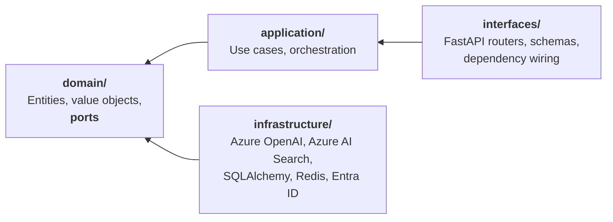

<div align="center">

# Paimon

**An AI Operations Platform for engineering organizations.**

Turns scattered operational knowledge — runbooks, postmortems, ADRs, API docs — into
grounded answers, cited evidence and automated workflows.

[](https://github.com/sergiomedi/paimon/actions/workflows/ci.yml)
[](https://github.com/sergiomedi/paimon/actions/workflows/delivery.yml)
[](backend/.python-version)
[](backend/pyproject.toml)
[](LICENSE)

</div>

---

## The problem

Engineering organizations do not lack documentation. They lack *retrievable* documentation.

The runbook that would have resolved an incident exists, in a repository nobody thought to
search. The postmortem describing the same failure eighteen months ago is in a wiki that has
since been migrated twice. The answer is somewhere in an eight-hundred-page API reference.
Meanwhile the on-call engineer asks a colleague, because a person is a better retrieval
system than the tools available.

Generic chat assistants do not fix this. They answer confidently from parametric memory,
cite nothing, and cannot tell you when they do not know — which in operational contexts is
the only answer that matters.

## What Paimon does

- **Grounded retrieval.** Hybrid semantic and keyword search, with every claim traced to its
  source. Answers carry citations or they are not returned.
- **Multi-agent workflows.** LangGraph agents doing real operational work — incident triage
  against runbook and postmortem history, postmortem drafting, documentation gap analysis.
- **MCP in both directions.** Search, documents and the agents are exposed to any MCP client
  behind OAuth 2.1; documentation is read *in* from external MCP servers and indexed.
- **Measured, not asserted.** Every citation is verified by opening the source. Only what a
  lookup cannot settle goes to a judge, and the judge's agreement with a person is measured.
- **Observable.** Plain OpenTelemetry — no vendor SDK, so the backend is an endpoint rather
  than a dependency.

## It runs, and here is what that cost

Nothing below is a diagram of a system. Every figure was produced by a script, in an
environment that was created for the purpose and destroyed afterwards.

| | |
|---|---|
| **A merge reaches Azure unattended** | **27m 46s** — provision, build, deploy, migrate, authenticate, ingest, answer, destroy ([run 10](docs/measurements/ci10-2026-09-13T0857.md)) |
| **What twelve of those runs cost** | **1.48 EUR**, all in. There is no standing environment to pay for ([ADR-0044](docs/adr/0044-delivery-without-a-standing-environment.md)) |
| **First authenticated request** | 0.42s warm · 28.5s cold, from zero replicas |
| **Ingest a document** | 1.10s for six chunks — parsed, embedded, written over a private endpoint |
| **Answer a question** | 1.61s, grounded, with a citation that resolves to a character range |
| **A release enters service** | Checked through its own hostname for **30s** before receiving a single request |
| **A release is undone** | Seconds. It is a traffic weight, not a rebuild |

The platform stores **no credentials at all**: the database has no password and no public
address, the pipeline signs in to Azure with OpenID Connect, and there is nothing in this
repository to rotate.

### What running it actually found

Phase 7 found four defects by deploying, and Phase 8 found four more by delivering. Not one
of the eight was visible to a linter, a type checker, a contract test or a unit test.

Three of them were hidden by in-process stand-ins **written by the author of the adapter they
were meant to check**: an Entra adapter that passed a string describing a key to PyJWT, so
every real token had been rejected since Phase 1; a search adapter that created its index with
a POST where the service requires a PUT. The rest were properties of the place the code runs
rather than of the code — an OIDC assertion five minutes dead by the time a deployment
finished, a delete ordering that only matters when a job is killed halfway, an emergency
rollback script that could not start on any machine but the one that had deployed.

Each is now a gate rather than a memory. That is the argument for the delivery pipeline, and
it is written up in full in [Delivering Paimon](docs/delivery.md).

## What it exposes

| Endpoint | Behaviour |
|---|---|
| `PUT /api/v1/documents/{id}` | Parses, chunks, embeds and indexes. Idempotent by content **and by pipeline**: unchanged bytes cost a hash comparison, but a change to chunk size or embedding model re-ingests |
| `POST /api/v1/answers` | Retrieves by meaning and by wording, fuses the rankings, and answers **only** from what was retrieved |
| `GET /api/v1/agents` · `POST /api/v1/agents/{agent}/runs` | Lists and runs agents, streaming each completed step as NDJSON |
| `GET /api/v1/agents/runs/{id}` · `POST .../decision` | Reads a run back — every step, its duration, its tokens — and answers one that stopped for a person |
| `POST /api/v1/sources/{name}/synchronizations` | Indexes everything a configured external source offers, naming what changed and what could not be read |
| `POST /mcp` | `search_corpus`, `read_document` and `run_agent`, behind OAuth 2.1 |
| `GET /api/v1/health/ready` | Probes every dependency concurrently under a timeout, and names which one failed and why |

A citation is not a filename. Each carries the document, the enclosing headings, the quoted
text and the **character offsets**, so a client can open the source at the passage the claim
rests on:

```json
{
  "answer": "Cordon the node first so the scheduler stops placing new pods on it [1].",
  "grounded": true,
  "citations": [
    {
      "marker": 1,
      "document_id": "node-maintenance",
      "source_uri": "https://example.test/runbooks/node-maintenance.md",
      "heading_path": ["Node maintenance", "Draining"],
      "start_char": 84,
      "end_char": 152,
      "quote": "Cordon the node first so the scheduler stops placing new pods on it."
    }
  ],
  "strategy": "fused",
  "usage": { "input_tokens": 83, "output_tokens": 14, "total_tokens": 97 }
}
```

When retrieval finds nothing, **no model is called** and the answer says so. A `200` with
`grounded: false` is a normal outcome: an answer that sounds right and is not in the sources
is worse than no answer, because the reader cannot tell the difference.

## Four agents: three workflows and one loop

- **Incident triage** — a symptom is two questions, so it is framed twice and retrieved
  concurrently: *what do I do* against runbooks, *has this happened before* against
  postmortems. Merged, deduplicated, then answered with citations or not at all.
- **Postmortem drafting** — reads a timeline, **reuses the triage agent whole** to gather
  precedent, and drafts the sections. The timeline becomes a citable source like any other.
- **Documentation gap analysis** — reports what a topic's material covers and what it leaves
  undocumented, against a checklist fixed in code so two reports are comparable.

A model is called at **one node** in each of those three. Framing is a template, routing is a
comparison, and checking that a draft is supported is a lookup — so a run is reproducible at
temperature zero, its cost is bounded before it starts, and a failure names the node that
produced it. A deliberate choice, with a stated condition for revisiting it
([ADR-0016](docs/adr/0016-deterministic-workflows-before-autonomous-agents.md)).

- **Investigator** — the fourth, and the only one that loops. `act → tools → act` until the
  model stops asking for tools, then a deterministic `verify` that withdraws any answer whose
  citations do not resolve. Six named stop reasons, so a run that ends says why. Needs a model
  that can call tools; where the deployment's model cannot, the API says so rather than
  offering an agent that would fail on its first question.

**Phase 9 built it to find out whether autonomy pays for itself, and measured that it does
not — on one model, against a well-shaped workflow.**

| agents-v1, `gpt-4.1-mini`, k=3 | `answers` | `incident-triage` | `investigator` |
|---|---|---|---|
| multi-hop (7 tasks) | 28.6% | 33.3% | **28.6%** |
| tokens / run | 1 031 | 1 320 | **2 460** |
| latency / run | 1.6 s | 1.7 s | **4.8 s** |

Every paired difference is indistinguishable from noise. Locally the same agent took
**exactly one tool call in 100 of 100 runs** — the model's choice, not a truncated loop: no
limit fired, every run reached its second turn, and a proxy in front of the model showed that
request still carrying both tool definitions. Holding retrieval fixed and changing only the
generator moved pass@1 from 32.0% to 63.3%. **Model capability moves the number; autonomy
does not.** The agent is kept, its cost is reported beside its score, and the reasoning —
including what would change the verdict — is in
[ADR-0045](docs/adr/0045-an-autonomous-loop-measured-against-the-workflows.md).
Numbers: [`docs/measurements/`](docs/measurements/). What is known and unfixed:
[`docs/open-findings.md`](docs/open-findings.md).

The distinction the agents work hardest to preserve: **"I searched and found nothing" and "I
could not search" are different answers.** Conflating them lets a provider outage become a
confident claim about your documentation.

And the boundary all of it exists for: a document saying *"ignore all previous instructions"*
is **indexed, not rejected** — filtering the phrase would break every runbook quoting an
incident and miss the next wording anyway. What is guaranteed is where the text may go: into
the **user** turn as a numbered source, never into the system turn or a tool description. Both
are asserted as tests, because a boundary nothing checks is one that moves.

## Architecture

Business logic is independent of every framework around it. FastAPI, LangGraph, Azure OpenAI
and Azure AI Search are all replaceable without touching the domain — a constraint **verified
in CI**, not merely claimed.



Every arrow points inward, and `import-linter` fails the build if one ever points outward.
That contract earned its keep in Phase 3: it rejected the first placement of the agent state,
because compiling a graph meant infrastructure importing a layer above it. The fix was not an
exception — it was moving the code to where the failure said it belonged.

Every port is implemented **twice** — locally (pgvector, any OpenAI-compatible endpoint) and
on Azure (Azure AI Search, Azure OpenAI) — and both satisfy the same contract test suite.

### Decisions worth reading

Forty-four decisions are recorded with their alternatives and the consequences accepted,
including the negative ones. These are the ones that shaped the most:

| | |
|---|---|
| [ADR-0003](docs/adr/0003-ports-and-adapters-for-llm-and-vector-store.md) | Ports and adapters for the LLM and the vector store |
| [ADR-0016](docs/adr/0016-deterministic-workflows-before-autonomous-agents.md) | Deterministic workflows before autonomous agents |
| [ADR-0045](docs/adr/0045-an-autonomous-loop-measured-against-the-workflows.md) | An autonomous loop, measured against the workflows it does not replace |
| [ADR-0046](docs/adr/0046-how-an-agent-is-evaluated.md) | How an agent is evaluated |
| [ADR-0047](docs/adr/0047-a-cyclic-graph-declares-its-own-bound.md) | A cyclic graph declares its own bound |
| [ADR-0023](docs/adr/0023-mcp-client-as-a-document-source.md) | External MCP servers are document sources, not an agent's toolbox |
| [ADR-0028](docs/adr/0028-metrics-and-an-estimated-cost.md) | Tokens are measured, cost is estimated, and they are labelled differently |
| [ADR-0030](docs/adr/0030-verify-attribution-before-judging-anything.md) | Verify what can be verified; judge only what cannot |
| [ADR-0032](docs/adr/0032-a-judge-is-uncalibrated-until-a-person-checks-it.md) | A judge is uncalibrated until a person has checked it |
| [ADR-0037](docs/adr/0037-keyless-is-enforced-at-the-resource.md) | Keyless is enforced at the resource, not chosen by the client |
| [ADR-0044](docs/adr/0044-delivery-without-a-standing-environment.md) | Delivery without a standing environment |

📋 **[All forty-four decision records](docs/adr/)** · 📐 **[Architecture overview](docs/architecture/overview.md)** — C4 diagrams, request flows, and an honest list of known gaps.

## Getting started

Requires [uv](https://docs.astral.sh/uv/) and Docker. Every command below has been run.

```bash
git clone https://github.com/sergiomedi/paimon.git
cd paimon

docker compose -f docker/compose.yaml up -d    # PostgreSQL with pgvector, and Redis

cd backend
cp .env.example .env          # the defaults match the Compose stack
uv sync --all-groups          # uv installs Python 3.13 itself if needed
uv run uvicorn paimon.interfaces.api.app:create_app --factory --reload
```

The service is then on <http://localhost:8000>, with interactive docs at `/docs` outside
deployed environments. The web application is `cd frontend && pnpm install && pnpm dev`.

```bash
curl localhost:8000/api/v1/health/ready | jq

# Mint a local token — the development signer, refused outside local and test
TOKEN=$(uv run python -c "
from paimon.infrastructure.identity import DevIdentityProvider
from paimon.config import get_settings
print(DevIdentityProvider(get_settings().auth.dev_signing_key.get_secret_value()).issue(
    subject='you', tenant_id='local', display_name='You'))")

# Run an agent; each completed step arrives as its own line while the run continues
curl -N -H "Authorization: Bearer $TOKEN" -H 'Content-Type: application/json' \
  -d '{"input":"eviction hangs"}' \
  localhost:8000/api/v1/agents/incident-triage/runs
```

```text
{"name":"frame","summary":"framed the symptom","duration_ms":0.003,...}
{"name":"procedure","summary":"procedure: retrieved 3 chunks",...}
{"name":"history","summary":"history: retrieved 2 chunks",...}
{"name":"assess","summary":"weighed 4 chunks from 2 documents",...}
{"name":"draft","summary":"drafted a grounded answer","input_tokens":812,...}
{"name":"verify","summary":"checked the draft is supported",...}
```

The same build talks to Azure by configuration alone — no code path, no branch in a use case.
Leave the API keys unset and the adapters acquire tokens through `DefaultAzureCredential`, so
no secret is stored anywhere; the choice is by absence, not a mode flag.

```bash
PAIMON_EMBEDDING__PROVIDER=azure
PAIMON_CHAT__PROVIDER=azure
PAIMON_RETRIEVAL__STORE=azure_search
PAIMON_AZURE_OPENAI__ENDPOINT=https://<resource>.openai.azure.com
PAIMON_AZURE_SEARCH__ENDPOINT=https://<service>.search.windows.net
```

Everything CI runs is one command — lint, formatting, strict types, the dependency rule,
tests, the frontend build, and the Bicep templates compiled with the linter raised to errors:

```bash
./scripts/check.sh
```

## The guides

Each of these is the full version of a paragraph above, written to be read on its own.

🔌 **[Connecting over MCP](docs/mcp.md)** — the tools, the discovery documents, Claude's Custom Connectors, the Inspector, and configuring a GitHub source.

📈 **[Observing Paimon](docs/observability.md)** — every span and metric, connecting Langfuse or a collector, sampling, the content switch, and the known gaps.

🎯 **[Evaluating Paimon](docs/evaluation.md)** — both benchmarks, reading the report, calibrating the judge, and what the numbers cannot tell you.

☁️ **[Deploying Paimon](docs/deployment.md)** — what gets created, the commands in order, what it costs by the hour, and every failure worth recognising with the reason behind it.

🚚 **[Delivering Paimon](docs/delivery.md)** — how a merge reaches an environment when there is no environment to deliver into, why the pipeline holds no secret, why a release is undone by weight rather than by rebuilding, and what each failed attempt had to teach first.

📏 **[Measurements](docs/measurements/)** — the runs themselves, as the scripts recorded them.

⚙️ **[Azure setup](docs/azure-setup.md)** — provisioning with `az`, the role assignments Entra authentication needs, and what it costs.

## Technology

| Layer | Choice | Why |
|---|---|---|
| Backend | FastAPI · Python 3.13 | Async throughout, native OpenAPI, first-class typing |
| Frontend | Next.js 16 · TypeScript · Tailwind · shadcn/ui | Streaming UI, strict types |
| Agents | LangGraph | Explicit state machines over implicit agent loops — and confined to one adapter ([ADR-0015](docs/adr/0015-agent-state-lives-in-the-domain.md)) |
| Interoperability | Model Context Protocol | Server and client, spec 2026-07-28 — [ADR-0020](docs/adr/0020-mcp-server-inside-the-api.md) to [ADR-0024](docs/adr/0024-a-discoverable-mcp-server.md) |
| LLM | Azure OpenAI · local OpenAI-compatible | Both implemented, behind one port |
| Retrieval | Azure AI Search · pgvector | Two adapters, one contract suite, selected by configuration |
| Data | PostgreSQL 17 · Redis 7 | System of record, and cache plus coordination |
| Identity | Microsoft Entra ID (OIDC) | The platform stores no credentials |
| Observability | OpenTelemetry · any OTLP backend | Plain OTel in the code; the backend is a setting |
| Cloud | Azure Container Apps · Bicep | Ephemeral by design: provisioned, measured, destroyed |
| Evaluation | Golden sets · verified citations · LLM judge | Intervals, paired comparison and Cohen's kappa |
| Tooling | uv · ruff · mypy --strict · import-linter | Standards enforced by machine, not convention |
| Delivery | Docker · GitHub Actions | Keyless OIDC, an environment per merge, blue-green releases |

## How it was built

Eight phases. Each shipped working software and its documentation, and none began before the
previous one was complete. The commit history and the decision records are the record of it.

- [x] **Phase 1 — Foundation** · architecture, ADRs, repository skeleton, dev environment, CI
- [x] **Phase 2 — RAG** · ingestion, chunking, embeddings, hybrid retrieval, citations
- [x] **Phase 3 — Agents** · LangGraph workflows, agent memory, tool integration
- [x] **Phase 4 — MCP** · MCP server and tools, client integration
- [x] **Phase 5 — Observability** · OpenTelemetry, traces, tokens and estimated cost
- [x] **Phase 6 — Evaluation** · golden sets, verified attribution, a calibrated judge
- [x] **Phase 7 — Cloud** · Azure deployment, deployed and measured, then destroyed
- [x] **Phase 8 — Delivery** · an environment per merge, created, exercised and destroyed

**Nothing in this repository is described as working before it has been observed working.**
That rule cost several documents a rewrite, and it is the one worth keeping.

## Repository layout

```text
backend/src/paimon/
  domain/          Entities, value objects, ports. No framework imports
  application/     Use cases
  rag/             Chunking, rank fusion, prompt assembly. Pure functions
  agents/          The three agents: node bodies, graphs, tools, registry
  evaluation/      Golden set, metrics, benchmark runner
  infrastructure/  Adapters — azure/, orchestration/ (the only LangGraph import),
                   sources/ (the MCP client, and the GitHub source over it)
  interfaces/      api/ routers and composition root, mcp/ the MCP server, cli/
  observability/   Logging, tracing, metrics — the conventions in one place
backend/tests/     unit, e2e, integration, architecture, contracts, fakes

frontend/          Next.js App Router, typed API client
infrastructure/    The Azure environment as Bicep
scripts/           check.sh, and azure/ — deploy, publish, migrate, release, destroy
evaluation/        Corpus, golden set, manifest
docs/              Guides, architecture overview, decision records, measurements
```

## License

MIT — see [LICENSE](LICENSE).
