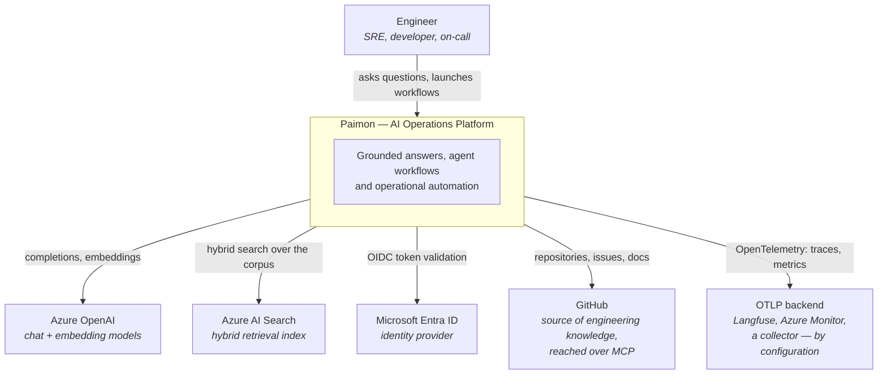
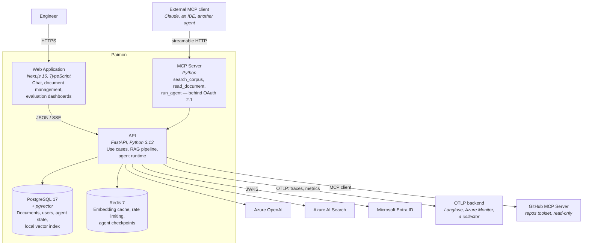
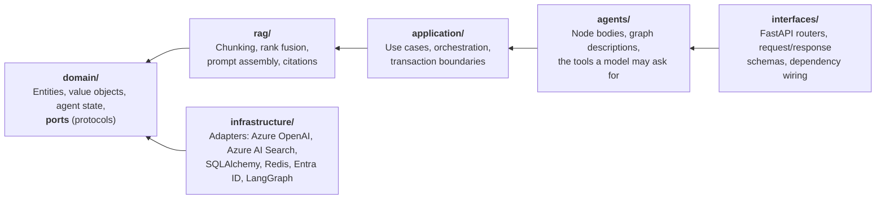
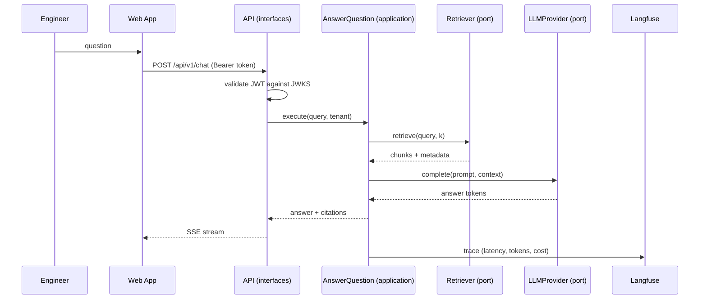
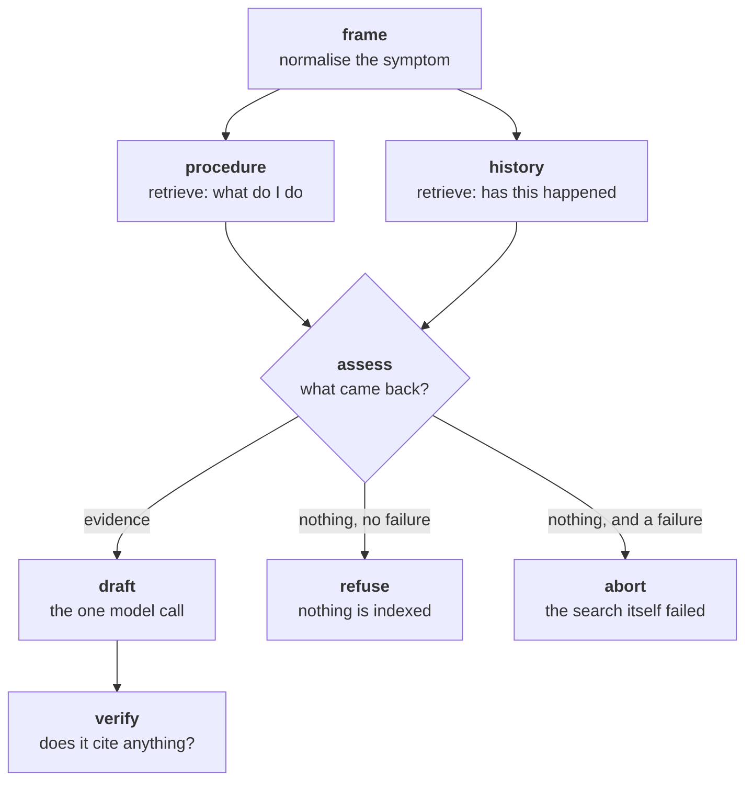

# Architecture Overview

> Status: living document. Updated at the end of every delivery phase.
> Last updated: Phase 1 — Foundation.

Paimon is an AI Operations Platform for engineering organizations. It turns
scattered operational knowledge — runbooks, postmortems, architecture decision
records, API documentation — into grounded answers and automated workflows.

This document describes the system at two levels of the [C4 model](https://c4model.com/):
system context and containers. Component-level detail lives in the module READMEs,
and every irreversible decision is recorded as an [ADR](../adr/README.md).

---

## 1. System context

**Why this boundary.** Paimon owns orchestration, retrieval strategy, evaluation and
observability. It does not own the models, the identity store or the knowledge sources.
Every one of those is reached through an interface defined in the domain layer, so any
of them can be replaced without touching business logic (see [ADR-0003](../adr/0003-ports-and-adapters-for-llm-and-vector-store.md)).

---

## 2. Containers

**Both directions, and they are not symmetric.** As a *server* the platform decides what to
expose and to whom; as a *client* it decides what to **trust**. The client refuses plaintext
and private addresses, pins the definitions of the tools it calls, and delivers what it reads
into ingestion rather than into an agent's context
([ADR-0023](../adr/0023-mcp-client-as-a-document-source.md)).

**Deployment note.** The agent runtime runs in-process with the API in Phases 1–6.
It is a separate *logical* container from day one — its own module with its own ports —
so extracting it into an independent service is a deployment change, not a rewrite.
That extraction becomes worthwhile when agent runs start starving the API's request
workers; the trigger is documented in [ADR-0007](../adr/0007-persistence-postgresql-sqlalchemy-alembic-redis.md).

---

## 3. Backend layering

Business logic must survive the frameworks around it. The backend is organized in four
layers with a strictly inward dependency direction.

| Layer | May import | Must never import |
|---|---|---|
| `domain` | stdlib, `pydantic` | anything else in the project, any framework |
| `rag` | `domain` | everything above it, `paimon.config` |
| `application` | `domain`, `rag` | `infrastructure`, `interfaces`, FastAPI |
| `agents` | `application`, `rag`, `domain` | `infrastructure`, **`langgraph`** |
| `infrastructure` | `domain` | `application`, `agents`, `interfaces` |
| `interfaces` | everything above `infrastructure` | `infrastructure` (except at the composition root) |

The row that looks strangest is the useful one: **`agents` may not import LangGraph.** An
agent is a description — named nodes, edges, and branches whose decisions are plain functions
— and `infrastructure/orchestration/` is what turns one into a running graph. So a node body is
an ordinary coroutine that a unit test calls and awaits, with no runtime involved
([ADR-0015](../adr/0015-agent-state-lives-in-the-domain.md)). The agent state and the graph
vocabulary live in `domain/agents/`, because the `AgentWorkflow` port is written in them and
any adapter has to speak them.

The composition root — the single place where concrete adapters are bound to ports — is
`interfaces/api/dependencies.py`. It is the only module allowed to import from
`infrastructure`.

**This table is enforced, not aspirational.** `import-linter` runs in CI and fails the
build on any violation. See [ADR-0002](../adr/0002-monorepo-layout-and-module-boundaries.md).

---

## 4. Request flow: a grounded answer

Note that `AnswerQuestion` depends only on the `Retriever` and `LLMProvider` protocols.
Whether retrieval hits pgvector or Azure AI Search, and whether completion hits a local
model or Azure OpenAI, is decided at startup by configuration.

---

## 4b. Agent flow: incident triage

Agents are **workflows before they are agents**: the steps are fixed, and a model decides
content at one node rather than deciding what happens next
([ADR-0016](../adr/0016-deterministic-workflows-before-autonomous-agents.md)). That is what
makes a run reproducible at temperature zero, boundable in cost before it starts, and scoreable
by the Phase 6 benchmark.

A symptom is two questions — *what do I do* lives in runbooks, *has this happened before* lives
in postmortems — and one embedding of the raw symptom sits between them and retrieves neither
well. The two framings run concurrently and their results are merged by a reducer that
deduplicates by chunk id, because both routinely reach the same passage.

The three terminal states are deliberately distinct. `refuse` means the corpus was searched and
holds nothing. `abort` means the search could not be performed, which is **not** a statement
about the corpus — conflating the two would have the platform assert that nothing is documented
because a provider was unreachable. `verify` withdraws a draft whose citations resolved to
nothing, and it is ordinary code: a model asked whether it is grounded will usually agree with
itself, while whether a marker resolved is a fact the platform already holds.

Postmortem drafting embeds this whole agent as a sub-component under a `precedent.*` prefix,
spliced at the description rather than run as a nested graph — so the orchestrator executes one
flat graph, one run is recorded, and every embedded node still appears in the trace under its
own name.

---

## 5. Non-functional posture

| Concern | Phase 1 position | Where it grows |
|---|---|---|
| **Scalability** | Stateless API, async I/O throughout, connection pooling sized explicitly | Phase 7: horizontal scaling on Container Apps |
| **Reliability** | Health and readiness probes, structured errors, no shared mutable state | Phase 5: SLOs on top of real telemetry |
| **Security** | OIDC token validation, secrets never in code, least-privilege DB roles | Phase 7: Azure Key Vault, managed identities |
| **Observability** | Structured JSON logs with correlation IDs from the first endpoint | Phase 5: OpenTelemetry traces + Langfuse |
| **Testability** | Ports make every external dependency substitutable; contract tests per port | Phase 6: automated evaluation pipeline |
| **Cost** | Local adapters keep development and CI at zero external spend | Phase 5: per-request cost attribution |

---

## 6. Known gaps

Recorded honestly rather than hidden — each is scheduled, not forgotten.

- **Multi-tenancy** is modelled in the domain (`tenant_id` on every aggregate) but not yet
  enforced at the database level. Row-level security lands with the RAG system in Phase 2.
- **The agent runtime shares the API process.** Still true, and now measured rather than
  assumed: agents hold a connection from a pool sized separately from the one HTTP handlers
  use, so a burst of runs degrades runs rather than the API. A run that outlives a deployment
  is a Phase 7 problem.
- **Documents are not MCP resources.** A resource template's function is wrapped in pydantic's
  `validate_call`, and a revalidated `Context` has lost its binding to the request — so a
  template cannot read the bearer token, and a resource that served documents without
  establishing whose they are is not worth having. `read_document` stays a tool until the SDK
  exposes request state to templates ([ADR-0022](../adr/0022-agents-as-mcp-tools.md)).
- **A source synchronisation runs inline in the request.** Honest at the document ceiling in
  configuration and dishonest above it. A scheduled worker is Phase 7's; the ceiling is what
  keeps the difference from arriving as a surprise.
- **No audit log for tool calls an agent makes to itself.** Calls arriving over MCP are audited
  with their tenant; a tool an agent calls inside a node is covered by that node's span and
  nothing finer.
- **The discovery document's path is a convention.** `server.json` is versioned and stable;
  the well-known path for serving it is still two competing proposals
  ([ADR-0024](../adr/0024-a-discoverable-mcp-server.md)).
- **A suspending node runs twice.** That is how the orchestrator replays an interrupt. Node
  bodies are pure so it is wasteful rather than wrong, but nothing enforces that the suspending
  node is a cheap one ([ADR-0019](../adr/0019-suspend-runs-through-state.md)).
- **No rate limiting on LLM calls yet.** Redis is provisioned for it; the token-bucket
  implementation lands with the first real Azure OpenAI adapter.
- **The newest spans are the likeliest to be lost.** Exporting is batched, so a process that
  dies badly takes with it the batch describing how it died. The shutdown path flushes; a hard
  kill does not get to.
- **A configured price list goes stale silently.** Every cost measurement carries the list's
  revision, which makes staleness visible in the data rather than preventing it — the most a
  platform can do about a number it does not own
  ([ADR-0028](../adr/0028-metrics-and-an-estimated-cost.md)).
