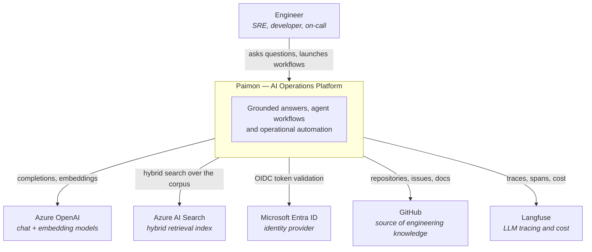
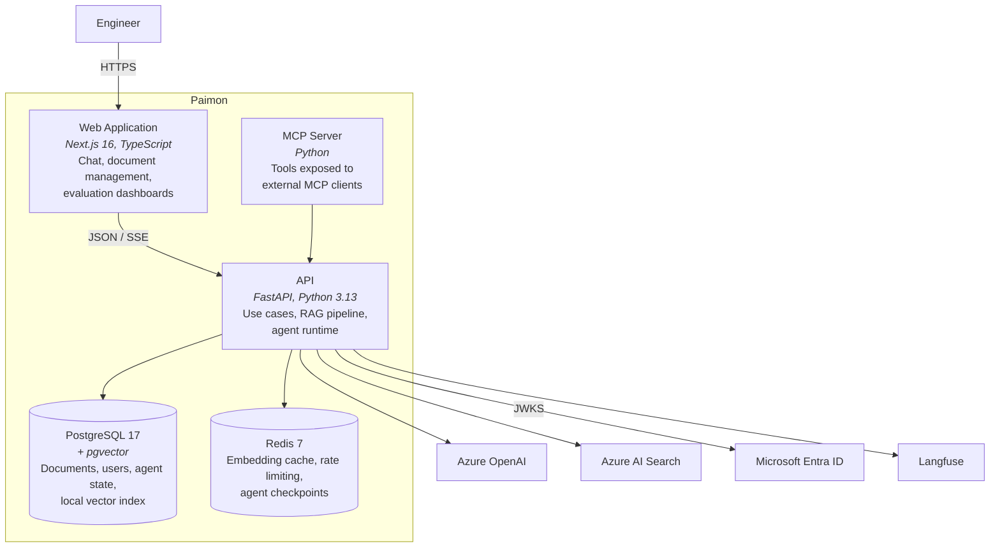
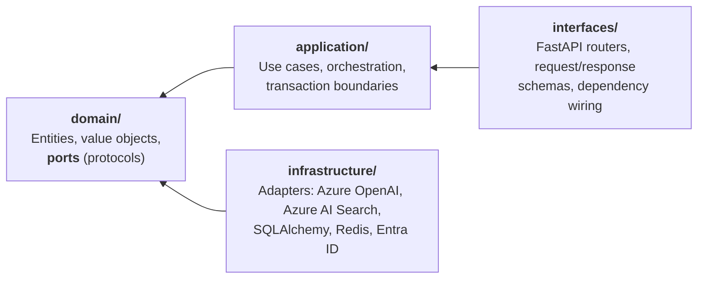
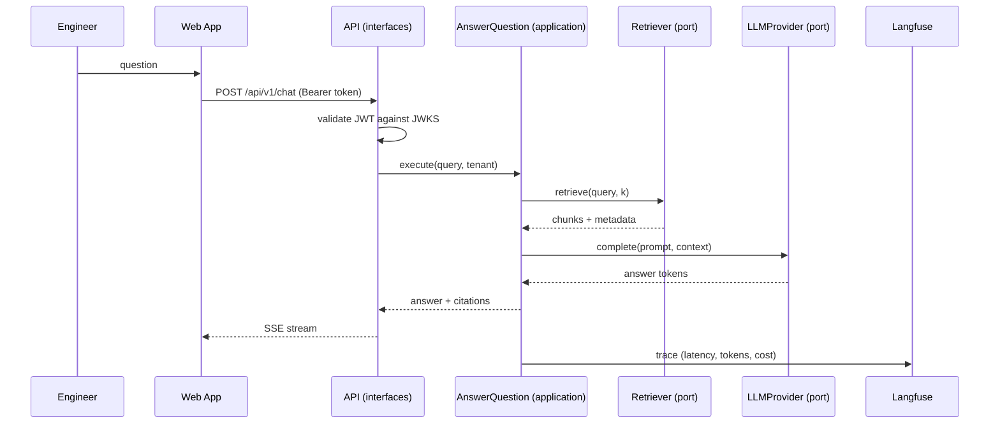

# Architecture Overview

> Status: living document. Updated at the end of every delivery phase.
> Last updated: Phase 1 — Foundation.

Paimon is an AI Operations Platform for engineering organizations. It turns
scattered operational knowledge — runbooks, postmortems, architecture decision
records, API documentation — into grounded answers and automated workflows.

This document describes the system at two levels of the [C4 model](https://c4model.com/):
system context and containers. Component-level detail lives in the module READMEs,
and every irreversible decision is recorded as an [ADR](../adr/README.md).

---

## 1. System context

**Why this boundary.** Paimon owns orchestration, retrieval strategy, evaluation and
observability. It does not own the models, the identity store or the knowledge sources.
Every one of those is reached through an interface defined in the domain layer, so any
of them can be replaced without touching business logic (see [ADR-0003](../adr/0003-ports-and-adapters-for-llm-and-vector-store.md)).

---

## 2. Containers

**Deployment note.** The agent runtime runs in-process with the API in Phases 1–6.
It is a separate *logical* container from day one — its own module with its own ports —
so extracting it into an independent service is a deployment change, not a rewrite.
That extraction becomes worthwhile when agent runs start starving the API's request
workers; the trigger is documented in [ADR-0007](../adr/0007-persistence-postgresql-sqlalchemy-alembic-redis.md).

---

## 3. Backend layering

Business logic must survive the frameworks around it. The backend is organized in four
layers with a strictly inward dependency direction.

| Layer | May import | Must never import |
|---|---|---|
| `domain` | stdlib, `pydantic` | anything else in the project, any framework |
| `application` | `domain` | `infrastructure`, `interfaces`, FastAPI |
| `infrastructure` | `domain` | `application`, `interfaces` |
| `interfaces` | `application`, `domain` | `infrastructure` (except at the composition root) |

The composition root — the single place where concrete adapters are bound to ports — is
`interfaces/api/dependencies.py`. It is the only module allowed to import from
`infrastructure`.

**This table is enforced, not aspirational.** `import-linter` runs in CI and fails the
build on any violation. See [ADR-0002](../adr/0002-monorepo-layout-and-module-boundaries.md).

---

## 4. Request flow: a grounded answer

Note that `AnswerQuestion` depends only on the `Retriever` and `LLMProvider` protocols.
Whether retrieval hits pgvector or Azure AI Search, and whether completion hits a local
model or Azure OpenAI, is decided at startup by configuration.

---

## 5. Non-functional posture

| Concern | Phase 1 position | Where it grows |
|---|---|---|
| **Scalability** | Stateless API, async I/O throughout, connection pooling sized explicitly | Phase 7: horizontal scaling on Container Apps |
| **Reliability** | Health and readiness probes, structured errors, no shared mutable state | Phase 5: SLOs on top of real telemetry |
| **Security** | OIDC token validation, secrets never in code, least-privilege DB roles | Phase 7: Azure Key Vault, managed identities |
| **Observability** | Structured JSON logs with correlation IDs from the first endpoint | Phase 5: OpenTelemetry traces + Langfuse |
| **Testability** | Ports make every external dependency substitutable; contract tests per port | Phase 6: automated evaluation pipeline |
| **Cost** | Local adapters keep development and CI at zero external spend | Phase 5: per-request cost attribution |

---

## 6. Known gaps

Recorded honestly rather than hidden — each is scheduled, not forgotten.

- **Multi-tenancy** is modelled in the domain (`tenant_id` on every aggregate) but not yet
  enforced at the database level. Row-level security lands with the RAG system in Phase 2.
- **The agent runtime shares the API process.** Acceptable while agent runs are short;
  revisited in Phase 3 when long-running graphs appear.
- **No rate limiting on LLM calls yet.** Redis is provisioned for it; the token-bucket
  implementation lands with the first real Azure OpenAI adapter.
